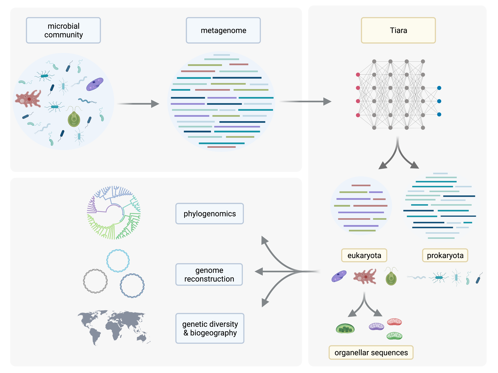

# Tiara

Deep-learning-based approach for identification of eukaryotic sequences in the metagenomic data powered by PyTorch.  

<p align="center">
      
</p>

The sequences are classified in two stages:

- In the first stage, the sequences are classified to classes 
      archaea, bacteria, prokarya, eukarya, organelle and unknown.
- In the second stage, the sequences labeled as organelle in the first stage 
      are classified to either mitochondria, plastid or unknown.

For more information, please refer to our paper:
[*Tiara: Deep learning-based classification system for eukaryotic sequences*](https://academic.oup.com/bioinformatics/article/38/2/344/6375939).


## Installation

### Requirements

- `Python >= 3.7`
- `numpy, biopython, torch, skorch, tqdm, joblib, numba`

### Quick installation

Detailed instructions can be found [here](detailed-installation.md).

#### Using `pip`

Run `pip install tiara`, preferably in a fresh environment.

#### Using setup.py

##### Latest stable release

- Download latest release from https://github.com/ibe-uw/tiara/releases.
- Unzip/untar the archive.
- Go to the directory.
- Run `python setup.py install`.

##### Latest developer version

```bash
git clone https://github.com/ibe-uw/tiara.git
cd tiara
python setup.py install
```

## Usage

Sample usage can be found [here](usage.md).

### Sample pipelines

Here we describe some pipelines to tackle metagenomic data that utilize **tiara**. 
- [Eukaryotic MAGs recovery](eukaryotic_pipeline.md)
- [Organellar fraction recovery](organellar_pipeline.md)
- [Extracting prokaryotic fraction](prokaryotic_pipeline.md)

## Citing Tiara

Michał Karlicki, Stanisław Antonowicz, Anna Karnkowska, Tiara: deep learning-based classification system for eukaryotic sequences, Bioinformatics, Volume 38, Issue 2, 15 January 2022, Pages 344–350, https://doi.org/10.1093/bioinformatics/btab672

## License

Tiara is released under an open-source MIT license 

### Name

In the Polish translation of the Harry Potter book series, the Sorting Hat
(which assigned wizards to different houses) was called *Tiara Przydziału*.
We thought that it's an appropriate name for a software which classifies 
sequences to different taxonomic units. In English the word *tiara* usually 
refers to a papal tiara. A papal tiara has three crowns, and life has three domains,
so maybe that's another explanation for the name of our program.

### Version history:

- `1.0.2` – added Python 3.9 compatibility, added an option to gzip the results. 
  Added this README section.
- `1.0.0`, `1.0.1` – initial releases.

